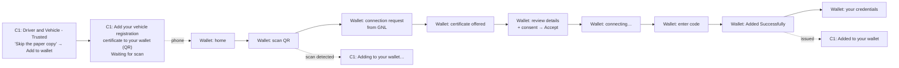

# Build brief: Flow 3, add the vehicle registration certificate to a digital wallet

**For:** the coding agent working on the GNL demo (MyGovNL / C1 + CertifiO ID)
**From:** Zubair Farahi
**Date:** 28 Sep 2026
**Priority:** after flows A and B. Flows A and B must keep working at all times (internal dry run on Tuesday 29 Sep, 4:00 PM). Build Flow 3 on its own branch and merge it only when it passes section 14.
**Customer demo:** date to be confirmed (planned around 9 Oct).

> **This brief replaces an earlier instruction.** The earlier briefs said "Flow 3 is not built" and "Add to wallet shows a toast". That has changed: build Flow 3 now. Everything else in the earlier briefs still applies (`GNL_IDV_Demo_Coding_Agent_Prompt.md` and `GNL_IDV_Next_Prompt_Yoti.md`).

---

## 1. Figma link (open it first)

**Flow 3 design, page "VC flows":**
https://www.figma.com/design/Dc1bPoXX1VoB9v1MtLvu8e/C1-%7C-GNL---R3?node-id=6171-70381

1. The link opens the page **"VC flows"** (node 6171:70381) in the file "C1 | GNL - R3".
2. On that page, find the section **"3rd Flow - Issuance of Vehicle Registration Certificate"**. Only this section is the spec.
3. Inside it, find each frame by **name and position** (table in section 4). Write each frame's node ID in `DEMO_AUDIT.md`.
4. For each frame, get the exact text, sizes, colours and images with your Figma tool.
5. If the section is missing, or the frame names don't match section 4, **stop and ask Zubair**. Don't guess.

**Don't build from these parts of the page** (if they are still there):
- "Paradym wallet": the designer's inspiration only.
- "Secondary scenario - Passwordless authentication": a far-future idea.
- "Flow example", "Sequence", "Scenario - Vehicle Registration Wallet Handoff": older drafts.

**Extra reference:** `design-reference/flow3/` (from `GNL_Flow3_Design_Reference.zip`):
- `flow3_style_reference.txt`: sizes, colours, fonts and layout of every Flow 3 screen, taken from the Figma "Copy as CSS" export. Use it to double-check your numbers.
- Icons and logos.

**Figma wins over the reference file.** Some text layers have generic names ("Button Text", "service-subtitle", "main-heading", "Heading here"…), so their real text is only in Figma.

---

## 2. What Flow 3 is (the story)

Flow 3 continues from Flow A (Driver and Vehicle). The user has just verified their identity, so the Driver and Vehicle page shows **"Trusted"**. Their vehicle, the **2015 CHEV IMT**, has a panel called **"Skip the paper copy"** with an **"Add to wallet"** button. That panel is the upsell. Flow 3 shows how GNL issues a **verifiable credential** (the vehicle registration certificate) into a digital wallet on the phone.

Two devices tell the story, as in Tatyana's design:
- **Desktop = C1 (MyGovNL):** it shows a QR code, and then live states: *Waiting for scan* → *Adding to your wallet* → *Added to your wallet*.
- **Phone = a wallet app:** a neutral, generic wallet (not Apple, Google or Paradym branded). The user scans the QR code, accepts the connection, reviews the certificate, accepts, enters a code, and sees the card in their wallet.

**Decisions from the walkthrough with Tatyana (designer), 28 Sep:**
- The steps copy the Paradym wallet logic, because it's the likely wallet partner. The UI stays generic on purpose.
- **Dynamic states** on the desktop QR page are wanted ("if we can introduce dynamic states, that would be cool"). Build them.
- The consent is **two short lines on the review screen**, not a separate screen. The wording may change: Maud provided wording, and Tatyana is checking it.
- The code step may change. Martin saw the wallet ask for **its own PIN** (not a one-time code). The Figma shows an **SMS code**. Tatyana is checking. Make it easy to switch (section 8, W-07).
- If you find a better way to show the two devices, Tatyana is fine with it, but keep her screens and texts.



---

## 3. How the two devices talk (mock issuer)

Reuse the sync you built for flows A and B: the store, `localStorage` and `BroadcastChannel`, and the phone view window. Add a sibling **mock credential issuer**, clearly labelled in the code as a demo mock:

```ts
type OfferStatus =
  | 'created'        // QR shown on C1
  | 'scanned'        // wallet opened the offer (scanner detected the QR, or a deep link)
  | 'connected'      // user accepted the connection (W-03)
  | 'viewed'         // user opened the offer details (W-05)
  | 'accepted'       // user accepted + consented (W-05)
  | 'code_verified'  // user entered the 6-digit code (W-07)
  | 'issued'         // credential stored in the wallet (W-08)
  | 'declined';      // user declined in the wallet

interface CredentialOffer {
  id: string;
  serviceId: 'driver-vehicle';
  credentialType: 'VehicleRegistrationCertificate';
  status: OfferStatus;
  createdAt: string;
  expiresAt: string;        // for the optional countdown (section 7)
  issuedAt?: string;
}
// createOffer(), getOffer(id), update(id, patch), subscribe(id, cb). Add a fake latency of 300–800 ms per call.
```

**What the desktop shows for each status:**

| Offer status | Desktop state line |
|---|---|
| `created` | Waiting for scan |
| `scanned`, `connected`, `viewed`, `accepted`, `code_verified` | Adding to your wallet |
| `issued` | Added to your wallet |
| `declined` | Back to "Waiting for scan". The same QR code keeps working. |

**The QR code:** generate it in code, as on the CertifiO hand-off page. It encodes `${PUBLIC_BASE_URL}/wallet/offer/:offerId`.
- Don't use the Figma QR image. It is a crop of a real CertifiO screenshot.
- In a code comment, note that a real issuer would use the OpenID4VCI format (`openid-credential-offer://…`). For the demo, an https link lets a real phone open the web wallet.

**How to run the wallet (same idea as flows A and B):**

| Mode | Priority | How it works |
|---|---|---|
| **Phone view window** | P0 | Clicking the QR code on the desktop opens the wallet in a narrow window (about 400×860), starting at **wallet home** (W-01). The presenter then taps "scan". The desktop updates by itself. |
| **Same device (C1 on a phone)** | P0 | On the mobile C1 page (F3-03), "Add to Apple Wallet" / "Add to Google Wallet" opens the wallet mock directly at the **connection request** (W-03), like the phone opening the wallet app. |
| **Presenter stage** | P1 | A route such as `/demo/wallet-stage` shows the C1 desktop page (left, scaled to fit) and the wallet phone (right) side by side, for one screen or a projector. Use two same-origin iframes so the sync works. It is hidden: link it only from the presenter controls. |
| **Real phone** | P2 | Scanning the QR with a real phone opens the wallet at W-03. Sync with the desktop needs the small mock server from the build brief (section 12.4). If the app is hosted as a static site, skip this mode. |

**Suggested routes** (keep yours if they already exist):
- C1: `/services/driver-vehicle/wallet`
- Wallet: `/wallet` (home), `/wallet/scan`, and `/wallet/offer/:offerId`, which picks the start screen and then goes to `/connect`, `/offer`, `/review`, `/connecting`, `/code`, `/success`
- Wallet credentials list: `/wallet/cards`

---

## 4. Screen map (find these frames in Figma)

Positions are inside the section, left to right in story order. "Frame name" is the Figma name.

| ID | Frame name | Size | Position | What it is |
|---|---|---|---|---|
| F3-01 | `D_driver-vehicle-service-page_verified_VC upsell` | 1440×1792 | 586, 2387 | C1 desktop: Driver and Vehicle, "Trusted", with the "Skip the paper copy" upsell. Already built (NL-25). |
| F3-01m | `m_driver-vehicle-mobile_VC upsell` | 393×2787 | 586, 4296 | The same page on mobile. Already built (NL-26). |
| F3-02 | `driver-vehicle-service-page` (3 frames) | 1440×1024 | 2857 / 5390 / 7538, 2387 | C1 desktop: "Add your vehicle registration certificate to your wallet" with the QR code. The three frames have the same layout; only the state text differs. |
| F3-03 | `digital-wallet-mobile` | 393×1471 | 2857, 3560 | C1 mobile version of F3-02: no QR, two wallet buttons. |
| W-01 | `wallet-home-wireframe` | 393×874 | 4361, 2387 | Wallet home |
| W-02 | `1. QR Scanner` | 390×844 | 6890, 2387 | Wallet QR scanner |
| W-03 | `government-issuer-interaction-request` | 390×881 | 9184, 2387 | Connection request from GNL (progress 20 %) |
| W-04 | `Screen 1: Renewal Approved` | 390×910 | 9682, 2387 | "Certificate offered" (40 %) |
| W-05 | `Screen 4: Credential Preview` | 393×1432 | 10241, 2387 | Review details + consent, Accept / Decline (40 %) |
| W-06 | `Screen 2: Wallet Redirect` | 390×844 | 10844, 2387 | "Connecting wallet..." (60 %) |
| W-07 | `transactional-code-entry` | 393×874 | 11358, 2387 | Enter the 6-digit code (80 %) |
| W-08 | `Screen 7: Success` | 393×844 | 11927, 2387 | "Added Successfully" (100 %) |
| W-09 | `Screen 8: Wallet Dashboard` | 393×844 | 12365, 2387 | Wallet: "Your credentials" |

Labels on the canvas confirm the order, for example "C1: QR code presented", "Wallet: open and scan the QR code", "Wallet: receive credential offer", "Wallet: view details of credential offer" and "Wallet: wait". A magenta designer note next to F3-02 lists the three dynamic states.

---

## 5. C1 screens (MyGovNL, Lato, existing GNL styles)

### F3-01 / F3-01m: "Trusted" page with the upsell (already built)
- Keep the page as it is (NL-25 / NL-26).
- **Change only the wiring:** "Add to wallet" (in the #E9ECEF "Skip the paper copy" panel under the 2015 CHEV IMT) now opens **F3-02** on desktop, or **F3-03** on mobile, instead of the toast.
- Before you change anything, compare this page with the two Figma frames. Fix only real differences, and list them in the audit.

### F3-02: Add your vehicle registration certificate to your wallet (desktop, 1440)
MyGovNL header and footer (existing). Main area: padding 48/80/80, two columns, 40 px gap.

**Left column (827 wide, 24 px gap):**
1. "← Back to Driver and Vehicle" (Lato 700 14, #004B87, underlined). It goes to F3-01.
2. Title "Add your vehicle registration certificate to your wallet" (Lato 700 32/150 %, #212326).
3. Subtitle (Lato 400 16/150 %, #5F6368). Text from Figma. The mobile frame's version reads "Your registration is verified and active. Scan the code with Apple Wallet or Google Wallet to add it."
4. **QR card**, centred in the column: 416×460, white, 1 px #D4D8DA, radius 6, padding 32/24, 16 px gap, content centred.
   - QR code, about 220×196.
   - **State line** (Lato 300 16, #5F6368, centred): Waiting for scan / Adding to your wallet / Added to your wallet. Take the exact wording and punctuation from the three Figma frames.
   - A block (368 wide, 8 px gap):
     - "Works with" (Lato 400 16)
     - Apple logo (grey, 20×24) + "Apple Wallet" (Lato 400 15, #5F6368), 10 px gap
     - Google Wallet logo (24×24) + "Google Wallet"
     - A 2-line text (Lato 300 16; text from Figma)
   - The "Apple Wallet" and "Google Wallet" rows are information only, not buttons.
5. Under the card: one line (Lato 400 16, #5F6368; text from Figma). An earlier draft had "This code expires in 8 minutes. Trouble scanning? Get a new code".

**Right column (413 wide) with 150 px top padding.** A card: #E9ECEF, radius 6, padding 24, 16 px gap.
- Title "What can you do with a digital vehicle registration certificate?" (Lato 800 24/150 %, #5F6368).
- Three rows, 24 px apart. Each row has a 64×64 icon box (#E9ECEF, radius 6, 40 px icon) and text (Lato 400 14/150 %, #5F6368):
  - Lock: "Sign in without a password"
  - ID card: "Skip the paperwork next time you renew or transfer ownership"
  - Eye: "Share only what's needed, like proving your vehicle is registered, without handing over your full VIN or address"

**Behaviour:**
- When the page opens, create the offer.
- The page listens to the offer and updates the state line (table in section 3).
- Clicking the QR code opens the phone view window.
- The state line uses `aria-live="polite"`.
- After "Added to your wallet", the page stays. The breadcrumb goes back to F3-01.

### F3-03: the same page on mobile (393)
Background #F4F6F8. Main area: padding 24/16/32, 24 px gap.
1. "← Back to Driver and Vehicle"
2. Title (Lato 700 28/130 %)
3. Subtitle "Your registration is verified and active. Scan the code with Apple Wallet or Google Wallet to add it." There is no QR on this page, so check this text with Tatyana (section 11).
4. Image card: white, 1 px #D4D8DA, radius 8, padding 16. It holds the Figma image "image 28" (143×131; bottom corners radius 24). Export it from Figma. If it still shows a driver's licence instead of a vehicle registration certificate, flag it.
5. Two buttons, 361×48, radius 8, padding 12/16, 12 px apart, Lato 700 15 white text:
   - "Add to Apple Wallet": black #000000, white Apple logo 20×24.
   - "Add to Google Wallet": #1F1F1F, Google Wallet logo 24×24.
   - Both open the wallet mock at W-03 (same-device mode).
6. A 2-line text (Lato 400 16, #5F6368; text and link from Figma). The link shows the "Not part of this demo" toast.
7. The "What can you do…" card: white, 1 px #D4D8DA, radius 6, padding 20.

---

## 6. Wallet screens: shared design (Inter, neutral wallet UI)

The wallet is **our own mock**, so follow Tatyana's Figma exactly. It is **not** the Yoti zone: the Yoti rules don't apply here. Don't use GNL styles or Lato inside the wallet.

**Tokens:**

| Token | Value |
|---|---|
| Font | **Inter** (self-host, weights 300, 500, 600, 700, 800, 900) |
| Ink | #081010. Secondary text: rgba(8,16,16,0.7). Tertiary: rgba(8,16,16,0.6) |
| Brand dark (teal) | #1E404D (progress fill, scan card, dark certificate card, links) |
| Mint | #DBF0EA (badge circles, icon boxes). Border mint: #86CEBA. Green: #45AB8E. Check stroke: #2E8E74 |
| Soft blue-grey | #F3F5FB (panels, code boxes, keypad area). Border: #E6E8EF |
| Other icon boxes | #E8F0F8 (Photo ID), #FDE8E8 (Proof of age) |
| Heading | Inter 900 36/110 %, letter-spacing −0.03em, #081010 ("Added Successfully": 48/100 %) |
| Supporting copy | Inter 300 18/150 %, 70 % ink, centred |
| Card title / description | Inter 600 16/150 % / Inter 300 14/120 %, 70 % ink |
| Primary button | 56 px tall, radius 8, #081010 background, 1.5 px #081010 border, text Inter 300 18 white, full width |
| Secondary button | 56 px, radius 8, transparent, 1.5 px rgba(8,16,16,0.6) border, text Inter 300 18 #081010 |
| Disabled button | #E6E8EF background and border, text Inter 600 18 at 70 % ink, arrow icon |

**Phone frame and chrome:**
- The Figma frames mix widths (390 / 393), radii (32 / 48) and heights (long screens are drawn tall to show all content). Use **one frame: 393×852, radius 48, 1 px #E6E8EF**. Long content scrolls inside it.
- On a real phone (viewport ≤ 430 px), drop the frame and go full screen.
- **Status bar:** "9:41" (Inter 600 15) with signal, wifi and battery icons. The Figma uses a placeholder icon there. At the bottom, a home indicator (140×5, #081010, radius 100).
- **Wallet header** (W-03 to W-08): 24 px side padding.
  - Top row: a back arrow (16 px, 70 % ink) on the left and a close ✕ (16 px, 2 px lines, 70 % ink) on the right.
  - Below it: a progress bar, track 6 px, #E6E8EF, radius 3, fill #1E404D.
  - Fill: W-03 20 %, W-04 40 %, W-05 40 %, W-06 60 %, W-07 80 %, W-08 100 %.
- **Issuer badge** (W-03, W-04, W-05): an 80 px mint circle (#DBF0EA) with the GNL crest flowers (about 47×57). Below it, "Government of Newfoundland & Labrador" (Inter 600 16, centred).

**Navigation rules:**
- Back arrow: previous wallet screen.
- Close ✕: wallet home. If the credential isn't issued yet, the offer returns to `created`, so the desktop shows "Waiting for scan" again.
- Every tappable thing does something (navigate or show a small neutral wallet toast). No dead ends.

---

## 7. Wallet screens, one by one

For every screen, **take all texts from Figma**. Texts I already know are quoted. "Expected meaning" is from the meeting, so use it only to check that you found the right text.

### W-01 Wallet home (`wallet-home-wireframe`)
- **Top area:** #F3F5FB, bottom corners radius 40. It contains:
  - The status bar.
  - A menu button: a white 48 px circle holding a black 44 px rounded square (radius 16) with 3 white lines.
  - A greeting title (Inter 900 36, centred) and a subtitle (Inter 300 16, 70 %, centred). Text from Figma.
- **Two quick-action cards**, 16 px gap, radius 16, padding 16:
  - **Scan card:** 172×140, #1E404D, QR icon top right, label Inter 600 18 white. Opens **W-02**.
  - **Present card:** 174×140, white, 1 px #E6E8EF, user icon, label Inter 600 18 ink. Shows the toast.
- A help link (Inter 300 14, #1E404D, underlined, centred). Shows the toast.
- **Two list cards:** 345×77, rgba(8,16,16,0.05), 1 px #E6E8EF, radius 16, a title and subtitle, and a chevron. The one that lists all cards opens **W-09**. The other shows the toast.

### W-02 Scan QR code (`1. QR Scanner`)
- Header "Scan QR Code" (Inter 900 18/130 %) with a close ✕ (1.5 px, ink). Close goes back to W-01.
- **Viewfinder:** 260×260, radius 24, 4 px dashed border rgba(8,16,16,0.4). It has a **scan line** (240×2, #86CEBA) that moves up and down.
  - Inside it, show a simulated camera view of **the same QR code as on the desktop**: slightly tilted, soft screen glow, a little blur that clears.
  - After about 1.2 s (or on tap), "detect" it: a short snap or pulse. Then set status `scanned` and go to **W-03**.
- Text (Inter 300 18/150 %, 60 % ink, centred, 280 wide): **"Point your camera at the QR code displayed on your computer."**
  - Deliberate copy fix: Figma says "the *login* QR code", because this frame came from the password-less login scenario.
- An outline button (360×56; text from Figma). Shows the toast.

### W-03 Connection request (`government-issuer-interaction-request`), progress 20 %
- Issuer badge.
- `main-heading` (Inter 900 36, centred) and `supporting-copy` (Inter 300 18, 70 %, centred). Text from Figma.
  - Expected meaning: GNL wants to connect and offer your new digital vehicle registration certificate.
- **Verified issuer card:** #DBF0EA, 1 px #86CEBA, radius 16, padding 16, 16 px gap. It has a 40 px #86CEBA circle with a shield-check icon, a title (Inter 600 16, #1E404D) and a description, and a chevron. The chevron shows the toast.
- **First-time card:** #F3F5FB, 1 px #E6E8EF, radius 16. It has a white 40 px circle with a switch/replace icon, a title (Inter 600 16) and a description. Text from Figma.
- **Buttons:**
  - Primary: expected "connect / accept". It sets status `connected` and goes to **W-04**.
  - Secondary: expected "decline". It sets status `declined` and goes to W-01.

### W-04 Certificate offered (`Screen 1: Renewal Approved`), progress 40 %
- Issuer badge.
- **"Certificate offered"** (Inter 900 36, centred).
- **"Your registration certificate is verified and ready for secure on-device storage."** (Inter 300 18, 70 %).
- **Card:** #F3F5FB, 1 px #E6E8EF, radius 16, padding 16, 24 px gap.
  - The ID-card icon (`icon-verifiable-credentials`), **"Vehicle registration certificate"** (Inter 600 16) and **"Verifiable Digital Credential"** (Inter 300 14, 70 %).
  - Inside the card: the primary button (expected "View offer"). It sets status `viewed` and goes to **W-05**.

### W-05 Review details and consent (`Screen 4: Credential Preview`), progress 40 %
- Issuer badge. Heading from Figma (the layer is called "Heading here").
- **Dark certificate card:** #1E404D, radius 20, padding 24, centred. It has the white GNL crest and wordmark (72×36) and **"Vehicle Registration Certificate"** (Inter 600 20, white).
- **"Verify your vehicle registration details before saving them onto this device."** (Inter 300 16, 70 %).
- **Detail rows:** each row has a label (Inter 300 12, 70 %) and a value (Inter 600 16), 12 px vertical padding, and a 1 px #E6E8EF line between rows.

  | Label | Value |
  |---|---|
  | Registration Number (License Plate) | JKM 026 |
  | Vehicle Identification Number (VIN) | 2G1125535F9268441 |
  | Make (Manufacturer) | Chevrolet |
  | Model | 2015 CHEV IMT |
  | First Registration Date | January 14, 2015 |
  | Expiry Date | January 14, 2036 |
  | Owner Identifier | Jason Momoa |
  | Issuing Country | Canada |
  | Issuing Authority | Government of Newfoundland & Labrador |

- **Consent** (2 lines, Inter 300 16, 70 %): **"It will be securely stored in your wallet. You control when its information is shared."**
  - Keep this text in one constant: Tatyana may replace it with Maud's wording.
- **Buttons, at the end of the content** (as in Figma, so the user scrolls through the details first):
  - Primary (expected "Accept"): sets status `accepted` and goes to W-06.
  - Secondary (expected "Decline"): sets status `declined` and goes to W-01.

### W-06 Connecting (`Screen 2: Wallet Redirect`), progress 60 %
- A 120 px mint circle with the Figma loading icon: 8 dots, one green (#45AB8E) and seven ink. Rotate it smoothly.
- **"Connecting wallet..."** (Inter 900 36, centred).
- **"Establishing a secure connection to transfer your digital certificate."** (Inter 300 18, 70 %).
- The layer "Powered by Portage Cryptography" is hidden in Figma. Don't show it.
- After about 1.8 s, go to **W-07**.

### W-07 Enter the code (`transactional-code-entry`), progress 80 %
- Heading from Figma (the layer is called "Heading here").
- **"We sent a 6-digit code by SMS to ••• ••• 0187. This code was not included in the QR code."** (Inter 300 16, 70 %).
- **Six code boxes**, 48×56, radius 8, 8 px gap:
  - Filled: #F3F5FB, 1 px rgba(8,16,16,0.6), digit Inter 700 24.
  - Active: white, **2 px #45AB8E**, blinking caret.
  - Empty: white, 1.5 px #E6E8EF.
  - The Figma shows "4 8 2" typed and the 4th box active. That is a mid-typing example; **start empty.**
- **Bottom area (#F3F5FB):**
  - The button is disabled until all 6 digits are entered, then becomes the primary style. Text from Figma.
  - **Keypad:** keys 1–9 and 0, each 130×54, white, 1 px #E6E8EF lines between keys, digits Inter 500 24. The bottom-left key is empty (#F3F5FB); the bottom-right key is backspace (#F3F5FB).
  - A physical keyboard also works.
- **Any 6 digits are accepted** (demo). Continue sets status `code_verified`, waits about 0.6 s, sets `issued`, and goes to W-08.
- **Code mode switch:** put the text and behaviour behind one constant: `CODE_MODE = 'sms' | 'wallet_pin'`.
  - `sms` (default, as in Figma): show a simulated SMS notification banner sliding down at the top of the phone, for example "Messages · Your GNL code is 482 915". Tapping the banner fills the code.
  - `wallet_pin`: no banner, and the text comes from Tatyana's updated design.

### W-08 Added Successfully (`Screen 7: Success`), progress 100 %
- A 100 px mint circle with a check (5 px stroke, #2E8E74). Draw the check in with a short animation.
- **"Added Successfully"** (Inter 900 48/100 %, centred).
- **"Your Vehicle Registration Certificate is secure and ready for use."** (Inter 300 18, 70 %).
- A primary button with a white arrow → (text from Figma). It goes to **W-09**.

### W-09 Your credentials (`Screen 8: Wallet Dashboard`)
- Top area as W-01 (status bar, menu button, greeting title).
- **Panel:** rgba(8,16,16,0.05), 1 px #E6E8EF, radius 16, padding 16. Header **"Your credentials"** (Inter 600 16) and **"3 cards total"** (Inter 300 14, 70 %), with a chevron.
- **Card 1, the new one, at the top:** white, 1 px #E6E8EF, radius 16, shadow 0 2px 8px rgba(0,0,0,0.07).
  - A mint 40 px icon box, **"Vehicle Registration Certificate"** and **"Issued …"**.
  - A #F3F5FB detail box: **Owner** Jason Momoa, **Plate** JKM 026, **Expiry** January 14, 2036 (label Inter 300 14, 70 %; value Inter 900 14).
- **"Photo ID"**, "Issued Aug 1, 2024" (icon box #E8F0F8 with a QR icon).
- **"Proof of age"**, "Issued Mar 15, 2023" (icon box #FDE8E8).
- **Before** the certificate is added, this screen shows only the 2 older cards and "2 cards total".
- The new card appears with a short slide-in and a soft highlight for about 3 s.
- Tapping a card shows the toast.

---

## 8. Creative freedom: what you may add, and what you must not change

**You may add (keep it subtle, professional, and fast):**
- Wallet screen transitions: a push from the right (about 250 ms) forward, and the reverse for back.
- Desktop state line: a cross-fade between states, a soft pulsing dot on "Waiting for scan", and animated dots on "Adding to your wallet".
  - Optional QR overlay: during "Adding", dim the QR to about 35 % with a small spinner. On "Added", dim it to about 20 % with a green check badge (#198754). The QR stays in place.
- The scanner simulation, the code banner, the check drawing in and the new card sliding in, as described above.
- In same-device mode, an iOS-style "◀ MyGovNL" link in the wallet status bar. It returns to F3-03, which then shows a GNL toast "Added to your wallet".
- Respect `prefers-reduced-motion`: jump straight to the end states.

**You must not:**
- Change any Figma text, except the fixes listed in section 10.
- Add screens beyond W-01 to W-09 (toasts and the SMS banner are fine).
- Brand the wallet as Apple, Google or Paradym.
- Use GNL styles or Lato inside the wallet.
- Call any real API.

---

## 9. Mock data

Add this to the persona file (flows A and B already use it). These are the Figma values:

```json
{
  "walletHolder": "Jason Momoa",
  "smsMaskedPhone": "••• ••• 0187",
  "vehicleRegistrationCertificate": {
    "plate": "JKM 026",
    "vin": "2G1125535F9268441",
    "make": "Chevrolet",
    "model": "2015 CHEV IMT",
    "firstRegistrationDate": "January 14, 2015",
    "expiryDate": "January 14, 2036",
    "owner": "Jason Momoa",
    "issuingCountry": "Canada",
    "issuingAuthority": "Government of Newfoundland & Labrador"
  },
  "existingWalletCards": [
    { "title": "Photo ID", "issued": "Issued Aug 1, 2024" },
    { "title": "Proof of age", "issued": "Issued Mar 15, 2023" }
  ]
}
```

- **"Issued …" date on the new card:** use **today's date** in the same format (for example "Issued October 9, 2026"). Figma shows "Issued October 31, 2026" as a placeholder.
- **"Reset demo"** also clears the wallet (the offer, the issued card and the counts).
- A refresh keeps the current state.

---

## 10. Deliberate changes from Figma (list each one in `DEMO_AUDIT.md`)

1. **Scanner text:** "login QR code" becomes "QR code" (W-02).
2. **QR code** is generated in code, not the Figma image.
3. **"Issued" date** = today.
4. **One phone frame** (393×852, radius 48). Long screens scroll.
5. **Real status bar icons** instead of the placeholder icon.
6. **Decline and close** return the offer to "Waiting for scan". This isn't designed.
7. **After issuing, the upsell on F3-01** shows an "added" state: the "Add to wallet" button becomes a disabled "Added to wallet ✓". This is a proposal; Tatyana to confirm. Until she confirms, keep it behind a flag, off by default.
8. **Optional extras from section 8**, if you build them.

---

## 11. Open questions (write them in `DEMO_AUDIT.md`, don't guess)

1. **Code step:** SMS code (Figma: "We sent a 6-digit code by SMS…") or the wallet's own PIN (what Martin saw)? Tatyana is checking.
2. **Consent wording on W-05:** Tatyana may replace it with Maud's wording.
3. **F3-03 subtitle:** it says "Scan the code…", but the mobile page has no QR.
4. **F3-03 image ("image 28"):** does it show the vehicle registration certificate?
5. **Upsell after issuing:** should it change (section 10, item 7)?
6. **Any text you could not find in Figma.** List the layer name and screen, and use a clear placeholder such as `[Button text from Figma]`. Never invent copy.

---

## 12. Accessibility and quality
- Semantic buttons and links, visible focus, and keyboard use (keypad digits, Enter to continue, Esc = close).
- Contrast AA.
- Alt text for the QR code ("QR code to add your vehicle registration certificate to your wallet") and for the logos.
- `aria-live` on the desktop state line and on the W-06 / W-07 status texts.
- No console errors. The app works offline (self-hosted fonts, no external calls).

---

## 13. Priorities

**P0:**
- F3-01 wiring.
- F3-02 with the three live states.
- F3-03.
- W-01 to W-09 in the phone view window and in same-device mode.
- The mock issuer with sync.
- Persistence and reset.
- No dead ends.
- `DEMO_AUDIT.md` "Flow 3" section.
- Updated `DEMO_SCRIPT.md`.

**P1:**
- Presenter stage.
- The animations and the scanner simulation.
- The SMS banner.
- The expiry countdown: if the Figma line under the QR shows an expiry time, make it count down (mm:ss). "Get a new code" (if present) makes a new offer and a new QR. At zero, silently create a new offer.
- The upsell "added" state (behind a flag).

**P2:**
- Real phone mode (mock server).

---

## 14. Done when

- [ ] Every frame in section 4 is found in Figma, with its node ID recorded in `DEMO_AUDIT.md`.
- [ ] Desktop story works end to end: F3-01 "Add to wallet" → F3-02 "Waiting for scan" → click the QR → wallet W-01 → W-02 → the desktop shows "Adding to your wallet" → W-03 … W-08 → the desktop shows "Added to your wallet" → W-09 shows the new card and "3 cards total".
- [ ] The mobile story works at 393 wide: F3-01m → F3-03 → "Add to Apple Wallet" → W-03 … W-09.
- [ ] Every screen matches its Figma frame (text, sizes ±2 px, colours, fonts). Save screenshots in `screenshots/flow3/`: C1 at 1440 and 393, wallet at 393×852.
- [ ] Decline, close and back work as in sections 6 and 7. Reset clears Flow 3. A refresh keeps the state.
- [ ] Flows A and B still work exactly as before (re-run their click paths).
- [ ] The build passes, there are no console errors, and the README explains Flow 3 and the presenter stage.

---

## 15. Deliver
1. A branch and PR with before/after screenshots.
2. `DEMO_AUDIT.md`, with a "Flow 3" section: node IDs, deliberate changes and open questions.
3. `DEMO_SCRIPT.md`, with Flow 3 added right after the Flow A "Trusted" page. Suggested talk track:
   1. "Skip the paper copy": click "Add to wallet".
   2. Show the QR and "Waiting for scan".
   3. Open the wallet and scan.
   4. The desktop changes to "Adding to your wallet".
   5. Accept the connection, view the offer, review the details and consent, Accept, and enter the code.
   6. Show "Added Successfully" and the desktop "Added to your wallet".
   7. Show the new card in the wallet.
   8. End on the talking points: sign in without a password, skip the paperwork, and share only what's needed.
4. `screenshots/flow3/`.
